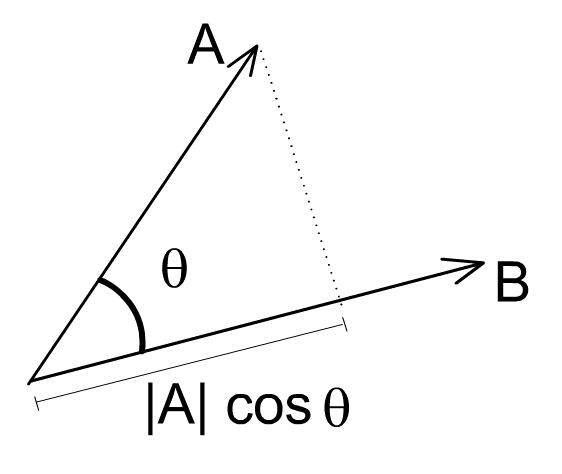
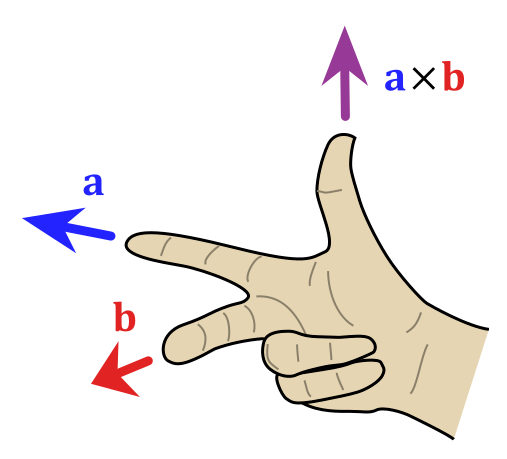
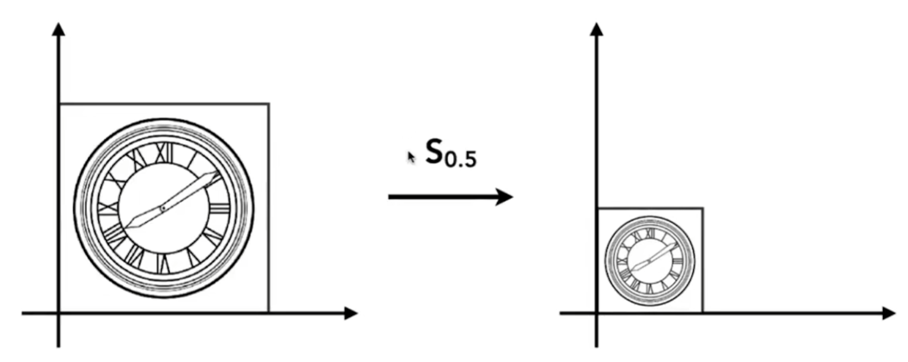
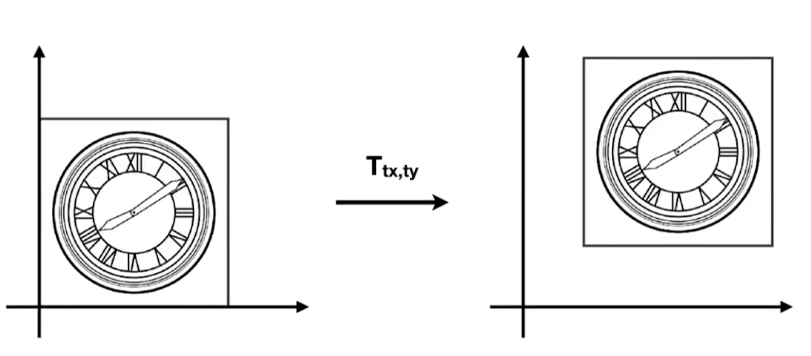

# 【1】数学基础

## 向量

**向量**是一个同时具有大小（magnitude）和方向（direction）的几何对象。向量可以想象成一个箭头，它的方向就是箭头所指的方向，它的大小就是它的长度，用 $||\mathbf{a}||$ 表示。

任意向量都可以分解成坐标系基向量的和，直观来说，向量的坐标就是它在各个基向量上的投影长度，比如在标准正交基下：
$$
\begin{bmatrix}a\\b\\c\end{bmatrix} =
a\begin{bmatrix}1\\0\\0\end{bmatrix}b\begin{bmatrix}0\\1\\0\end{bmatrix}c\begin{bmatrix}0\\0\\1\end{bmatrix}
$$

### 向量点积（Dot product）

#### 几何定义

在**欧几里得空间**中，向量的点积为：
$$
\mathbf{a}\cdot\mathbf{b}=\Vert\mathbf{a}\Vert\Vert\mathbf{b}\Vert\cos{\theta}
$$

它的几何意义就是一个向量在另一个向量上的投影长度。

#### 坐标定义

在标准正交基下，两个向量 $\mathbf{a}=[a_1,a_2,\cdots,a_n]$  和 $\mathbf{b}=[b_1,b_2,\cdots,b_3]$  的点积为：
$$
\mathbf{a}\cdot\mathbf{b}=\sum_{i=1}^{n}a_ib_i=a_1b_1+a_2b_2+\cdots+a_nb_n
$$
也可以写成矩阵形式：
$$
\mathbf{a}\cdot\mathbf{b}=\mathbf{a}^T\mathbf{b}
$$

### 向量叉积（Cross product）

向量的叉积仍然是一个向量，其定义仅适用于**三维空间**，记为 $\mathbf{a}\times\mathbf{b}$。在 n 维空间上的推广叫做向量积，记为 $\mathbf{a}\wedge\mathbf{b}$。

#### 几何定义

叉积 $\mathbf{a}\times\mathbf{b}$ 的定义为向量 $\mathbf{c}$，它垂直（正交）于 $\mathbf{a}$ 和 $\mathbf{b}$，其方向由**右手定则**确定，其大小等于 $\mathbf{a}$ 和 $\mathbf{b}$ 所张成的**平行四边形的面积**。
$$
\mathbf{a}\times\mathbf{b}=\Vert\mathbf{a}\Vert\Vert\mathbf{b}\Vert\sin(\theta)\mathbf{n}
$$
其中，$\theta$ 是 $\mathbf{a}$ 和 $\mathbf{b}$ 之间的非钝角的夹角（即 0 到 180 度之间），$\mathbf{n}$ 是垂直于包含 $\mathbf{a}$ 和 $\mathbf{b}$ 的平面的单位向量，它的方向为右手定则的**正向定向**（positively oriented）。

#### 坐标定义（计算）

详见 [Wiki - Cross product#Computing](https://en.wikipedia.org/wiki/Cross_product#Computing)。

## 矩阵和矩阵乘法

站在空间的角度，矩阵代表着**空间的变换**（Tranformation），矩阵乘法的本质就是**从一个空间转换到另一个空间**。就比如我们进入了一个平行时空，在这个新空间中，所有东西都比原来小一倍，包括我们自己。

具体一点，矩阵可以看成是新空间的**基向量组**（行向量组成的），基向量改变了，也就意味着空间中所有向量和点都发生了改变。因为**向量的坐标就是它在每个基向量上的投影大小**，所以矩阵里的坐标代表的是新空间所有向量相对于原空间基向量的投影。

> 可以这么理解：我们是来自地球宇宙的人，到了新的平行宇宙，我们肯定还是拿它和地球宇宙做对比。

以列向量为标准，假设原空间为三维空间，以它为参考系，那么基向量组为：
$$
\begin{bmatrix}
\mathbf{e}_x^T\\\mathbf{e}_y^T\\\mathbf{e}_z^T
\end{bmatrix}=
\begin{bmatrix}
1&0&0\\
0&1&0\\
0&0&1\\
\end{bmatrix}
$$
此时有一个矩阵
$$
\begin{bmatrix}0.5&0\\0&0.5\end{bmatrix}
$$
那么该矩阵的意义就是将原空间降到了二维，$e_z$ 直接消失，同时基向量 $e_x$ 和 $e_y$ 都变成了原空间的一半大小，于是空间中的所有向量和点也会跟着变换，x 轴和 y 轴各缩小一半。

如图所示，一个实际应用就是缩放图像的大小。
$$
\begin{bmatrix}x^{\prime}\\y^{\prime}\end{bmatrix} = \begin{bmatrix}0.5&0\\0&0.5\end{bmatrix}\begin{bmatrix}x\\y\end{bmatrix}
$$

可以看到，计算过程对应的就是向量映射到每个轴（叉乘）。

### 齐次坐标

#### 为什么要引入齐次坐标？

**点的位置会改变，而向量不会**——向量具有平移不变性，没有位置的概念。

无论是大小、方向还是维度的变换，我们只需要用一个矩阵就可以表示。然而，对于点的位置变换，只凭一个矩阵却做不到了。

按照之前的方法，左图中的平移变换我们必须写成**仿射变换**（Affine Transformation）的形式：
$$
\begin{bmatrix}x^{\prime}\\y^{\prime}\end{bmatrix}=
\begin{bmatrix}a&b\\c&d\end{bmatrix}
\begin{bmatrix}x\\y\end{bmatrix}+
\begin{bmatrix}t_x\\t_y\end{bmatrix}
$$
如此简单的平移变换，却不得不带上一个难看的尾巴，和之前的形式也不统一，那么有没有办法用一个矩阵就能表示平移变换呢？

是的，它就是**齐次坐标**（Homogenous Coordinates）：为原向量或点引入一个 w 维，并给变换矩阵加上一列权重向量。

#### 为原向量或点引入 w 维

对于点，w = 1。
$$
\begin{bmatrix}x\\y\\1\end{bmatrix}
$$
对于向量，w = 0。
$$
\begin{bmatrix}x\\y\\0\end{bmatrix}
$$

#### 为变换矩阵引入 w 维

同时为变换矩阵也增加 w 维。
$$
\begin{bmatrix}x^{\prime}\\y^{\prime}\\w^{\prime}\end{bmatrix}=
\begin{bmatrix}1&0&t_x\\0&1&t_y\\0&0&1\end{bmatrix}
\begin{bmatrix}x\\y\\1\end{bmatrix}=
\begin{bmatrix}x+t_x\\y+t_y\\1\end{bmatrix}
$$
为什么向量为 0？因为向量没有位置的概念，所以用 0 保证 w 维不会造成任何影响。

#### 引入齐次坐标的操作不变性

齐次坐标厉害的地方在于，它还能保证向量和点之间进行计算后的结果为我们的期望：

- vecotr + vector = vector  (0 + 0 = 0)
- point - point = vector  (1 - 1 = 0)
- point + vector = point  (1 +0 = 1)
- point + point = ?

最后的点加点实际上本来也没什么意义，不过我们还是人为地做了一个定义：

对于齐次坐标，
$$
\begin{bmatrix}x\\y\\w\end{bmatrix} = \begin{bmatrix}x/w\\y/w\\1\end{bmatrix}
$$
这意味这，**两个点相加的结果是它们的中点**。