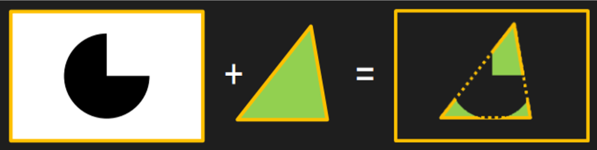
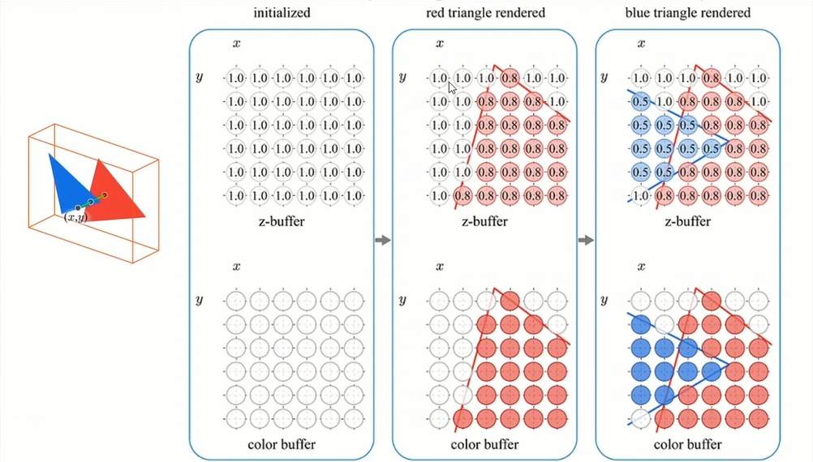
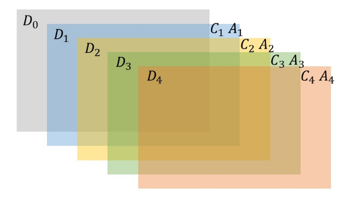

# 【2】渲染管线流程

**渲染（Rendering）**指的是把三维场景在二维屏幕上显示出来的过程。这个工作由 CPU 和 GPU 共同完成。

## CPU 阶段（应用程序阶段）

CPU 阶段主要流程为：

1. **剔除（Culling）**：剔除掉场景中不可见的物体，包括在视锥之外的、被遮挡的等等；
2. **设置渲染顺序**：规定一定的顺序来渲染各模型，保证近处遮挡远处、半透明混合等效果的正确性；
3. **提交数据到 GPU 显存**：将数据打包发送给 GPU，这些数据包括：
   1. 模型信息：顶点坐标、法线、UV、切线、顶点颜色、索引列表等等；
   2. 变换矩阵：MVP 变换矩阵；
   3. 渲染信息：着色器、材质参数、灯光信息等；
4. **调用 DrawCall 命令**。

## GPU 阶段

1. **顶点作色（坐标转换）**：把模型顶点数据的坐标空间有模型空间转换到裁剪空间，这中间经历了 MVP 变换，由顶点着色器（Vertices Shader）完成。

2. **图元装配**：把顶点三个一组装配成三角面，并进行裁剪、背面剔除、屏幕映射（也就是视口变换）等操作。

3. **（可选）曲面细分**：将三角面细分成更小的三角面，使得模型具有更丰富的细节，由曲面细分着色器（Tessellation Shader）完成。

4. **（可选）几何扩充**：通过增加顶点，把一个点或一个图元扩充成一个更复杂的多边形，由几何着色器（Geometry Shader）完成。

5. **光栅化（Rasterize）**：图像本身都是连续的，而我们的屏幕是离散的像素点，所以需要光栅化，**把连续分布的图元离散化为片段**（fragment）。所谓片段，就是屏幕的一个个像素。

6. **Early-Z：**提前进行深度测试，省去多余的片元着色计算。这是硬件自动启用的优化，GPU 根据每个 DrawCall 的渲染状态判断"提前测深度安不安全"，安全就早测省算，不安全就退化到着色后再测。

7. **片段着色**：光栅化只是表述了一个三角网格是如何覆盖每个像素的，接下来还需要由片段着色器（Fragment Shader）来计算每个像素的最终颜色，包括纹理覆盖和光照计算。

   1. **纹理贴图**（Textures）：也叫纹理映射，就是把一张贴图的**纹素**（texel，texture pixel）映射到 3D 模型的像素上。
   2. **光照计算**（Lighting）：常用的一个模型叫 Phong 模型。

8. **测试混合**：这是最后一步，DirectX 管它叫**输出合并**（Output-Merge），而 OpenGL 管它叫**逐片段操作**（Per-fragment Operations）。这一步主要是决定各模型每个片段的可见性。可见性的判断包括很多测试，包括 Alpha 测试、模板测试、深度测试等等，当一个片段完成所有测试后，就把它的颜色值和深度值和帧缓冲区混合。

   1. **Alpha Test**：测试片段的透明度。

   2. **模板测试**（Stencil Test）：默认不开启。这是一个开发者可以高度配置的阶段，如果开启了模板测试，GPU 会首先读取模板缓冲区中该片元位置的模板值，然后将该值和读取到的参考值进行比较，这个比较函数可以是由开发者指定的，例如小于时舍弃该片元，或者大于等于时舍弃该片元。如果这个片元没有通过这个测试，该片元就会被舍弃。

      

   3. **深度测试**（Depth Test）：现实中，近处的物体会遮挡远处的物体，图形学中也一样，每个模型的片段存在一个怎样的遮挡关系呢？这就需要深度测试。

   4. **混合**（Blend）：一个片段经过层层测试，最终得到了它的颜色值和深度值，然后这两个值分别和颜色缓冲区和深度缓冲区进行混合。

## 片元着色器之后：输出合并流水线

GPU 每画一个像素，背后维护两块独立的内存，每块都是一个跟屏幕等大的二维数组：

  - **颜色缓冲（Color Buffer / Framebuffer）**：存最终看到的颜色 RGB。
  - **深度缓冲（Depth Buffer / Z-Buffer）**：存"目前为止，这个像素位置上最近的、写过深度的那个表面离相机多远"，一个 float，来自顶点着色器的 `positionCS : SV_POSITION` 的 z 值。

>  关键认知：深度缓冲里存的**不是颜色，而是"遮挡记录"**——一张记录"谁挡在前面"的备忘录。它的唯一用途是给后续片元做"我该不该被画出来"的判断。

这两块缓冲互不干涉。一个片元可以"更新了深度却没更新颜色"，也可以"更新了颜色却没更新深度"。ZTest 和 ZWrite 就是分别控制"要不要查这张备忘录"和"要不要往这张备忘录写"。

很多人以为"片元着色器算完颜色 → 直接写进屏幕"。不对，实际上中间还有一整道"测试 +混合"工序，顺序大致是（D3D/OpenGL 术语）：

1. 片元着色器输出 (color, depth 可选)   
2. 剪裁测试 Alpha Test
3. 模板测试 Stencil Test                             ← 读/写 Stencil 缓冲（又一个独立缓冲）
4. 深度测试 ZTest                                        ← 读 Depth 缓冲，比较，决定这个片元"留不留"
5. 写入深度 ZWrite（若 ZTest 通过）    ← 把当前 depth 写进 Depth 缓冲
6. 混合 Blending                                          ← 用 blend 因子把片元 color 和 Color 缓冲里的 color 合并
7. 写入颜色缓冲

记住这个工序里的两个要点：

    1. ZTest 在 Blending 之前。深度测试通不过的片元，根本走不到混合这一步就被丢了。
    2. ZTest 和 ZWrite 是相邻但独立的两个步骤：ZTest 是"读+判断"，ZWrite 是"写"，各有自己的开关。

### ZTest 与 ZWrite 的本质

#### ZTest（深度测试）——"我这个片元，配不配被看见？"

它做的是一次比较：**当前片元的深度 Z_fragment**   vs   **深度缓冲里已存的 Z_buffer**

**比较函数**（LEqual / Less / Greater / Equal / Always / Never）决定"什么情况下算通过"。

- 通过：继续往后走（有机会进混合、进颜色缓冲）；
- 不通过：这个片元当场销毁，什么都不做。

`LEqual`（小于等于才通过）= "我只在比已记录的最近表面更近（或一样近）时才被画"。这是不透明物体的标准配置，实现"近的挡远的"。

> 注意：ZTest 通不通过，跟"这个片元最终颜色是什么"完全无关。它只看深度这一个数。

#### ZWrite（深度写入）——"我这个片元，要不要把我的深度登记进备忘录？"

它做的是一次写操作（前提是 ZTest 已通过）：`Z_buffer[pixel] = Z_fragment`

- 开了：这个片元成为新的"最近遮挡者记录"，后续片元要跟它比；
- 关了：深度缓冲纹丝不动，颜色该怎么混合怎么混合，但备忘录里没有它的痕迹。

#### 为什么必须拆成两个开关？

因为**"该不该被看见"**和**"该不该成为别人的遮挡标准"**是两件不同的事。把它们解耦，才能表达不同的渲染意图（如透明物体只需要检测深度，但不要写入深度导致本该“叠”上去变成了“挡”）：

| 意图                   | ZTest  | ZWrite |
| ---------------------- | ------ | ------ |
| 不透明物体             | LEqual | On     |
| 透明物体               | LEqual | Off    |
| 始终在最上层 (UI/特效) | Always | Off    |

## Early-Z：片元着色器之前的提前深度测试

GPU 其实有**两次深度测试**的机会，硬件自己决定用哪个。上面说的输出合并流水线中的 ZTest 其实是 Early-Z 无法生效时的兜底方案。

触发退化的关键条件是**"片元的最终存活/最终深度是否可预知"**：一旦不可预知，硬件就不敢提前测。即**不做 Alpha 裁剪、不自定义深度**的片元才会被判断为可用 Early-Z。

1. `clip()`/`discard`（Alpha 裁剪）：一个像素最终留不留，取决于片元着色器里采样出的 alpha。GPU 没法在着色前知道，只能先跑完着色器再决定。Early-Z 失效退化成 Late-Z，被挡的"洞"也得白算一遍。
  2. 片元着色器输出自定义深度 `SV_Depth`：最终深度是片元着色器算出来的，无法提前判断。

> 尽量触发 Early-Z（少用 discard/自定义深度）并让它的收益最大化（不透明前→后排序，让近物先填深度）是正确的性能方向。但记住**触发≠收益**：触发由 draw call 状态决定，收益由排序和场景遮挡决定，两者都要满足才真的省。同时排序有 CPU 成本、且可能与合批冲突，按场景实际瓶颈权衡，别盲目追求"全部前→后、绝不裁剪"。

## CPU Cull 和 GPU 深度测试 的区别

一个例子说明：相机前方有一面墙，墙后一栋大楼（都很大），大楼后一只小虫。

- **CPU Cull**：大楼和墙都在视锥内 → 都保留，都提交给 GPU。小虫若在视锥外 → 直接不提交。Cull 不知道墙挡住了大楼（除非开了遮挡剔除），它只关心"在不在视野里"。
- **深度测试**：墙先画，深度缓冲记下墙的深度。画大楼时，墙后面那些像素在深度测试时发现"我比墙更远"→ 测试失败 → 大楼被墙挡住的像素跳过，大楼只画露在墙外的边缘。小虫若提交了且被墙挡，同样被深度测试干掉。

也就是说，CPU Cull  是物体级的，判断物体的包围盒在不在相机的视锥体内来决定要不要剔除。GPU 深度测试是片元级的，判断像素有没有被前面画的东西挡住来决定深度测试结果。
