# 【3】MVP 变换

## 空间转换过程

一个模型从制作显示到在游戏中显示到屏幕上，它的坐标空间是在不断转换的，这个流程为：

### 模型空间 -> 世界空间

当美术在创作一个 3D 模型时，他创建的所有顶点和面都是相对于他所使用的三维坐标系（模型空间）来说的。 如我们说一个点的坐标是 `(1,1,1)`，它的值相对于模型空间坐标系的原点而言的。如果我们想建立多个模型之间的空间关系，那我们就需要把它们转化到同一个三维坐标系（世界空间）下。

在世界空间下，我们可能会想要移动、旋转和缩放一个模型，这就是**模型变换**（Model transformation）。

### 世界空间 -> 视图空间

当所有的物体都在正确位置的世界空间位置之后，我们现在要考虑如何将它们投影到屏幕上，这通常分两步：

1. 第一步是把所有对象变换到另一个空间，称为**视图空间**或者摄像机空间。
2. 第二步是使用一个**视图矩阵**进行实际的投影。

视图空间坐标系的定义通常是以摄像机为中心，负 Z 轴与相机的朝向对齐。

> **为什么我们需要一个视图空间**？
>
> 视图空间是一个辅助空间，它可以简化数学运算，让一切都保持优雅。

把物体从世界空间变换到视图空间的行为就是**视图变换**（View tranformation）。

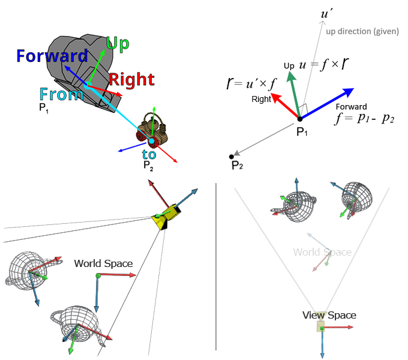

### 视图空间 -> 投影空间（裁剪空间）

接下来就是把物体投影到的 2D 屏幕上，为此，我们需要将空间中的所有对象变换到**投影空间**，它是一个规范化的 $(-1, 1)^3$ 的立方体，然后，再把投影空间中那些摄像机视线之外的物体给「裁剪」掉，因此投影空间常常也叫裁剪空间。

> **为什么需要投影空间？**
>
> 投影对于计算机图形学上对图像显示的剪裁来说非常方便，规范立方体范围外的任何东西都在摄像机的视图区域之外，可以不用被显示，并且简化了扁平化操作（我们只需要舍弃 z 值就可以得到 2D 图像）。

把物体从裁剪空间变换到投影空间的行为就是**投影变换**（Projection transformation）。

### 投影空间 -> 屏幕空间

最后，将所有 -1 到 1 的范围重新映射到 0 到 1 的范围，然后缩放至视口的宽高，并将三角面光栅化到屏幕上。

从投影空间变换到屏幕空间的变换叫做**视口变换**（Viewport transformation）。

## 模型变换

模型变换描述的是物体在世界坐标系变化。

### 基本变换

#### 缩放（Scale）

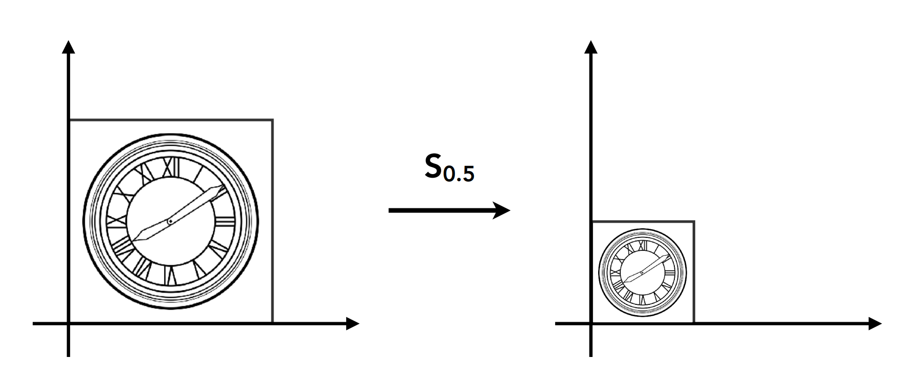
$$
\begin{pmatrix}x^{\prime}\\y^{\prime}\\1\end{pmatrix}= \begin{pmatrix}s_x&0&0\\0&s_y&0\\0&0&1\end{pmatrix} \begin{pmatrix}x\\y\\1\end{pmatrix}
$$

#### 镜像（Reflection）

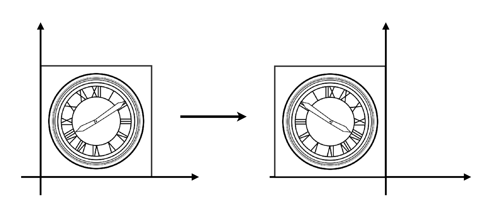
$$
\begin{pmatrix}x^{\prime}\\y^{\prime}\\1\end{pmatrix}= \begin{pmatrix}-1&0&0\\0&1&0\\0&0&1\end{pmatrix} \begin{pmatrix}x\\y\\1\end{pmatrix}
$$

#### 剪切（Shear）

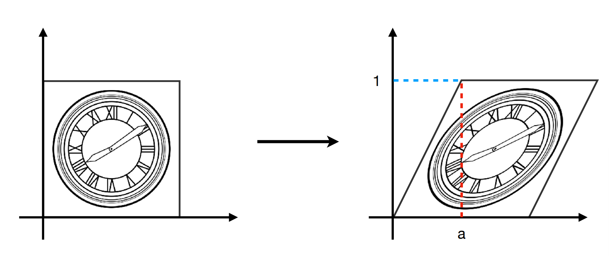
$$
\begin{pmatrix}x^{\prime}\\y^{\prime}\\1\end{pmatrix}= \begin{pmatrix}1&a&0\\0&1&0\\0&0&1\end{pmatrix} \begin{pmatrix}x\\y\\1\end{pmatrix}
$$

#### 旋转（Rotation）

默认是绕原点、逆时针旋转，相当于基坐标顺时针旋转 。

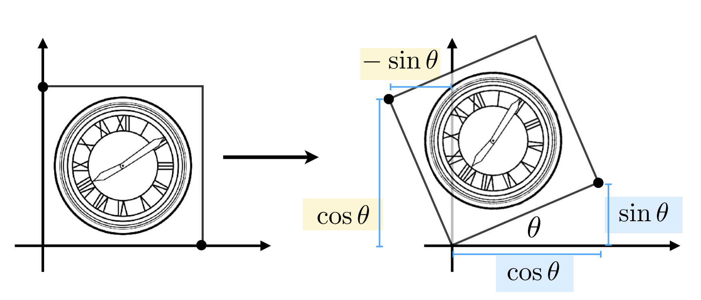
$$
\begin{pmatrix}x^{\prime}\\y^{\prime}\\1\end{pmatrix}= \begin{pmatrix}\cos\theta&-\sin\theta&0\\\sin\theta&\cos\theta&0\\0&0&1\end{pmatrix} \begin{pmatrix}x\\y\\1\end{pmatrix}
$$

#### 平移

齐次坐标的目的就是把平移操作用一个矩阵表示，从而统一形式。

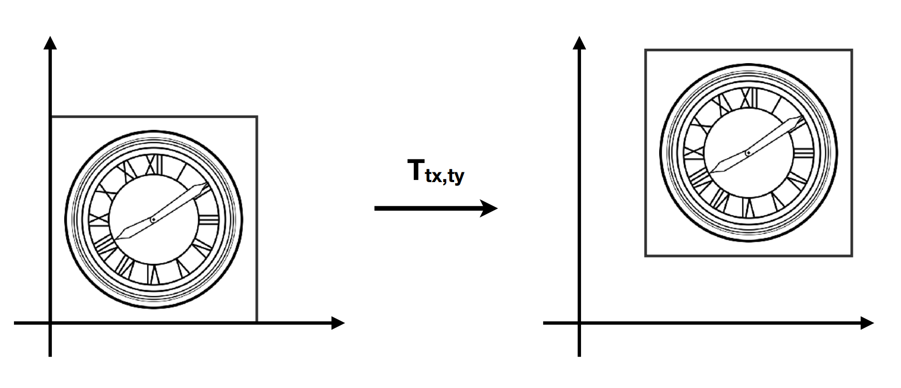
$$
\begin{pmatrix}x^{\prime}\\y^{\prime}\\1\end{pmatrix}= \begin{pmatrix}1&0&t_x\\0&1&t_y\\0&0&1\end{pmatrix} \begin{pmatrix}x\\y\\1\end{pmatrix}
$$

> ##### 如何以任意点为中心旋转？
>
> 正常情况下，旋转意味着以原点为中心旋转，但如果我想以任意点旋转呢？很简单，先移动整个物体使得旋转中心与原点重合，再进行旋转，完了再移回去就行。
>
> 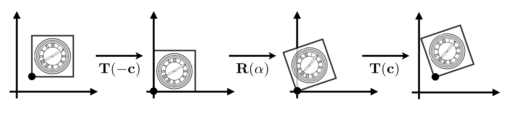
> $$
> \mathbf{T}(\mathbf{c})\cdot\mathbf{R}(\alpha)\cdot\mathbf{T}(-\mathbf{c})
> $$

### 3D 变换

上面提到的基本变换都是在 2D 的视角下进行的，不过不同维度之间的变换是触类旁通的，3D 变换本质上和 2D 一样，只是矩阵多了一个维度，另外就是旋转变换稍微复杂一些。

#### 3D 坐标轴的 xyz 怎么排布的？

原则就是 xyz 之间具有循环对称的性质，意思就是说，
$$
\begin{align*}
x \times y &= z \\
y \times z &= x \\
z \times x &= y
\end{align*}
$$
可以看到，xyz 可以按右手定则循环得到。

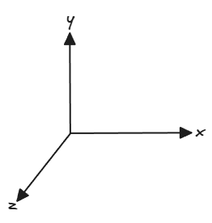

#### 3D 旋转变换

3D 的旋转我们一般认为是绕着某个轴旋转，实际上就是在另两条轴上的平面旋转，不同轴的定义如下。注意，由于右手定则，所以绕 Y 轴旋转的正负号有些不一样。
$$
R_x(\alpha)=
\begin{pmatrix}
1 & 0 & 0 & 0 \\
0 & \cos\alpha & -\sin\alpha & 0 \\
0 & \sin\alpha & \cos\alpha & 0 \\
0 & 0 & 0 & 1 \\
\end{pmatrix}
$$

$$

R_y(\alpha)= \begin{pmatrix} \cos\alpha & 0 & \sin\alpha & 0 \\ 0 & 1 & 0 & 0 \\ -\sin\alpha & 0 & \cos\alpha & 0 \\ 0 & 0 & 0 & 1 \\ \end{pmatrix}
$$

$$
R_z(\alpha)= \begin{pmatrix} \cos\alpha & -\sin\alpha & 0 & 0 \\ \sin\alpha & \cos\alpha & 0 & 0 \\ 0 & 0 & 1 & 0 \\ 0 & 0 & 0 & 1 \\ \end{pmatrix}
$$

## 视图变换

视图变换描述的是从世界空间变换到视图空间的行为。

### 相机的定义

一个相机由以下几个元素组成：

1. Position    
2. Look-at / gaze direction    
3. Up direction (垂直于 look-at direction)

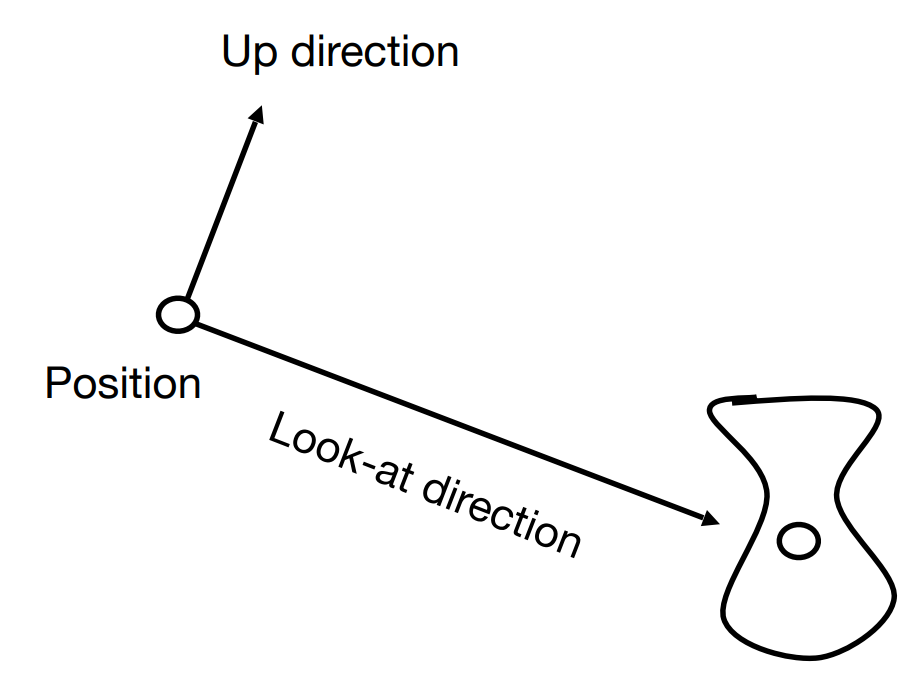

### 如何计算物体的摄像机坐标？

想象摄像机带着空间中的模型一起运动（相对位置不变，摄像机坐标也不变），直到摄像机和世界坐标的原点重合，并且 look-at 方向为 -Z 轴，up 方向为 Y 轴——这个时候，物体的摄像机坐标就等于世界坐标。于是，我们把世界坐标到摄像机坐标的转换问题变成了世界坐标的变换问题。这个移动摄像机的变换就是**规范化**摄像机的变换，记为 $M_{view}$。空间中模型的原世界坐标进行该变换后，就成为了摄像机坐标。

如何计算 $M_{view}$？分解一下规范化摄像机的过程，包括：

1. 把摄像机的位置 $\vec{e}$ 从移动的目标点移回原点；
2. $\hat{g}$、$\hat{t}$ 以及 $\hat{g}\times\hat{t}$ 分别旋转到 -Z 轴、Y 轴和 X 轴。

即 $M_{view}$ 可以分解为两个矩阵，包括平移矩阵 $T_{view}$ 和旋转矩阵 $R_{view}$：
$$
M_{view} = R_{view}T_{view}
$$
平移矩阵很好推导，他就是
$$
T_{view}= \begin{pmatrix} 1 & 0 & 0 & -x_e \\ 0 & 1 & 0 & -y_e \\ 0 & 0 & 1 & -z_e \\ 0 & 0 & 0 & 1 \end{pmatrix}
$$
旋转矩阵很难得到，不过我们再换个思路：相机旋转到坐标轴，反过来就是坐标轴旋转到相机，也就是 $R_{view}^{-1}$，又因为**旋转矩阵是正交矩阵**，所以逆矩阵就是转置矩阵，即 $R_{view} = (R_{view}^{-1})^{-1} = (R_{view}^{-1})^\top$。对于 $R_{view}^{-1}$ 就很直观很好得出了，它就是基向量旋转到相机方向的变换：
$$
R_{view}^{-1}= \begin{pmatrix} x_{\hat{g}\times\hat{t}} & x_t & x_{-g} & 0 \\ y_{\hat{g}\times\hat{t}} & y_t & y_{-g} & 0 \\ z_{\hat{g}\times\hat{t}} & z_t & z_{-g} & 0 \\ 0 & 0 & 0 & 1 \end{pmatrix} \Rightarrow R_{view}= \begin{pmatrix} x_{\hat{g}\times\hat{t}} & y_{\hat{g}\times\hat{t}} & z_{\hat{g}\times\hat{t}} & 0 \\ x_t & y_t & z_t & 0 \\ x_{-g} & y_{-g} & z_{-g} & 0 \\ 0 & 0 & 0 & 1 \end{pmatrix}
$$

## 投影变换

投影变换描述的是把物体从观测空间变换到投影空间的行为，从而方便后续扁平化工作。

投影有两种：**正交投影（Orthographic projection）**和**透视投影（Perspective projection）**。区别就在于透视投影的规范正方体相比于正交投影有「近大远小」的现象，因此正交投影常用于工程制图。

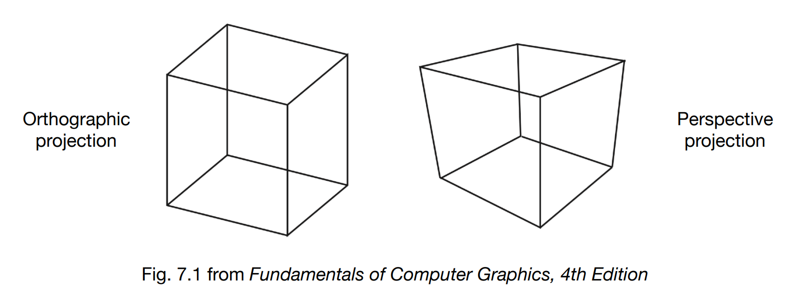

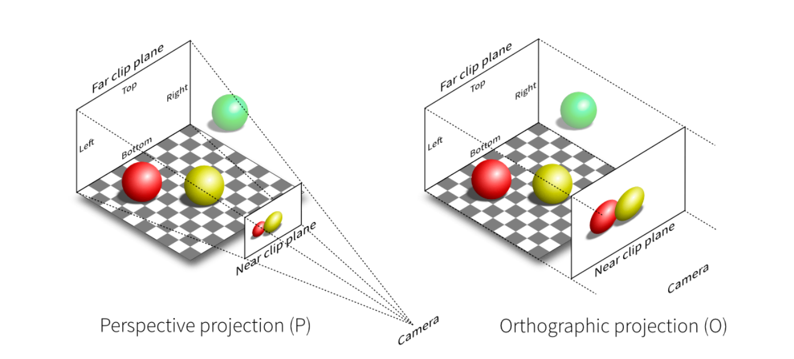

### 正交投影

正交投影的观测空间是一个长方体。

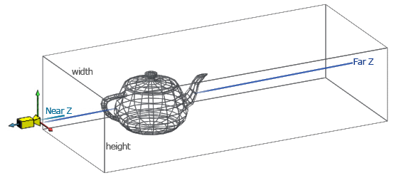

首先确定一下已知参数，即观测空间 X 轴上的左边界值 `left` 和右边界值 `right`，Y 轴上的上边界值 `top` 和下边界值 bottom，Z 轴上的近面距离 `near` 和远面距离 `far`：

> 注意，摄像机是**朝负 Z 轴方向**看的，因此 `near` 应该是大于 `far` 的值。

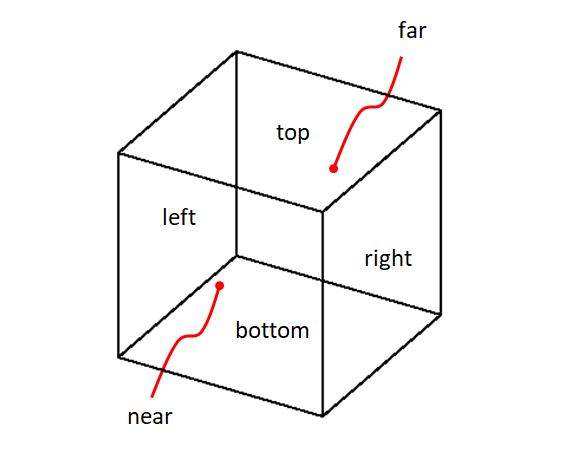

整个正交投影的过程就是先平移到原点，再缩放到 -1 到 1 范围的立方体。

观测空间的中心点为：
$$
(\frac{r+l}{2},\ \frac{t+b}{2},\ \frac{n+f}{2})
$$
因此平移矩阵为：
$$
\begin{pmatrix}
1&0&0&-\text{midX}\\
0&1&0&-\text{midY}\\
0&0&1&-\text{midZ}\\
0&0&0&1
\end{pmatrix}=
\begin{pmatrix}
1&0&0&-\frac{r+l}{2}\\
0&1&0&-\frac{t+b}{2}\\
0&0&1&-\frac{n+f}{2}\\
0&0&0&1
\end{pmatrix}
$$
缩放后的长宽高都是 2，因此缩放矩阵为（注意，由于我们是右手定则，所以 Z 轴的 `near` 才是更大的那一个）：
$$
\begin{pmatrix}
\frac{2}{r-l}&0&0&0\\
0&\frac{2}{t-b}&0&0\\
0&0&\frac{2}{n-f}&0\\
0&0&0&1
\end{pmatrix}
$$
两者相乘即得到最后的正交投影矩阵：
$$
M_{ortho}=
\begin{pmatrix}
\frac{2}{r-l}&0&0&\frac{l+r}{l-r}\\
0&\frac{2}{t-b}&0&\frac{b+t}{b-t}\\
0&0&\frac{2}{n-f}&\frac{f+n}{f-n}\\
0&0&0&1
\end{pmatrix}
$$

### 透视投影

透视投影的观测空间为一个纺锤体，叫做 **frustum（视锥）**。

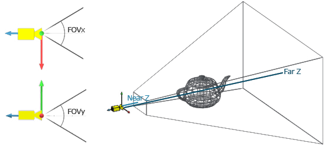

首先确定一下已知参数，也就是视锥定义所得到的参数，即 Y 轴视野 `FovY`，近面距离 `near`，远面距离 `far`，以及宽高比 `aspect_ratio`，那么根据图中公式推导就能得出 l、r、b、t。

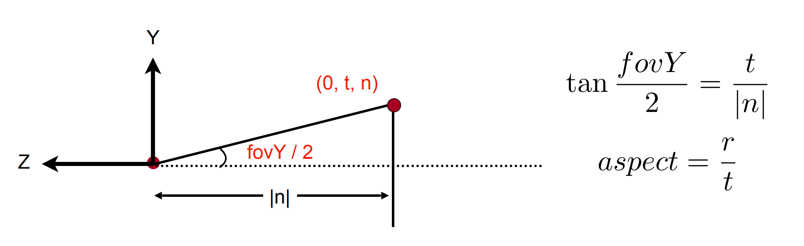

整个透视投影相比于正交投影，就是**多了一步把 frustum 压缩成 cube 的过程**。那么，如何计算压缩矩阵 $M_{persp\rightarrow ortho}$ 呢？

首先根据相似三角形定理，得到：
$$
y^{\prime}=\frac{n}{z}y\quad x^{\prime}=\frac{n}{z}x
$$
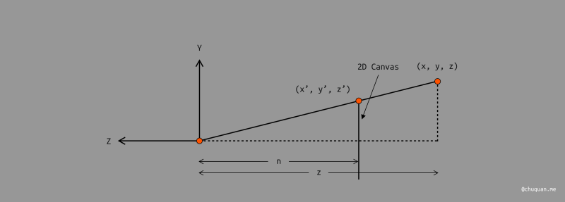

于是，对于观测空间中的任意一个点 $(x, y, z)$，经过压缩后得到点 $(x^{\prime},y^{\prime},z^{\prime})$ 为：
$$
\begin{pmatrix}
x^{\prime}\\
y^{\prime}\\
z^{\prime}\\
1
\end{pmatrix}=
\begin{pmatrix}
nx/z\\
ny/z\\
?\\
1
\end{pmatrix}
\overset{\cdot z}{=}
\begin{pmatrix}
nx\\
ny\\
?\\
z
\end{pmatrix}
\tag{a}
$$
对点应用压缩矩阵 $M_{persp\rightarrow ortho}$ 得到关系式：
$$
\begin{pmatrix}
x^{\prime}\\
y^{\prime}\\
z^{\prime}\\
1
\end{pmatrix}=
M_{persp\rightarrow ortho}
\begin{pmatrix}
x\\y\\z\\1
\end{pmatrix}=
\begin{pmatrix}
nx\\ny\\?\\z
\end{pmatrix}
\tag{b}
$$
解得：
$$
M_{persp\rightarrow ortho}=
\begin{pmatrix}
n&0&0&0\\
0&n&0&0\\
?&?&?&?\\
0&0&1&0
\end{pmatrix}
$$
接下来我们求解第三行，经过观察可以得到两点依据：

1. 压缩后，近平面上的所有点不会改变；
2. 压缩后，远平面上的 $z$ 值不会改变。

基于第一点，设 $z=n$ 带入式 $\text{(a)}$ 和式 $\text{(b)}$，有：
$$
M_{persp\rightarrow ortho}
\begin{pmatrix}
x\\y\\n\\1
\end{pmatrix}=
\begin{pmatrix}
x\\
y\\
n\\
1
\end{pmatrix}
=
\begin{pmatrix}
nx\\
ny\\
n^2\\
n
\end{pmatrix}
$$
可以推导得到第三行：
$$
\begin{align*}
\begin{pmatrix}
?&?&?&?
\end{pmatrix}
\begin{pmatrix}
x\\y\\n\\1
\end{pmatrix}&=
n^2\\
\begin{pmatrix}
?&?&?&?
\end{pmatrix}&=
\begin{pmatrix}
0&0&?&?
\end{pmatrix}
\end{align*}
$$
设 $\begin{pmatrix}0&0&?&?\end{pmatrix}$ 为 $\begin{pmatrix}0&0&A&B\end{pmatrix}$，有：
$$
\begin{align*}
\begin{pmatrix}
0&0&A&B
\end{pmatrix}
\begin{pmatrix}
x\\y\\n\\1
\end{pmatrix}&=n^2\\
推得：An+B&=n^2\tag{c}
\end{align*}
$$
基于第二点，设 $z=f$ 带入式 $\text{(a)}$ 和式 $\text{(b)}$，有：
$$
M_{persp\rightarrow ortho}
\begin{pmatrix}
x\\y\\f\\1
\end{pmatrix}=
\begin{pmatrix}
nx/f\\
ny/f\\
f\\
1
\end{pmatrix}
\overset{\cdot f}{=}
\begin{pmatrix}
nx\\
ny\\
f^2\\
f
\end{pmatrix}
$$
根据已知的第三行 $\begin{pmatrix}0&0&A&B\end{pmatrix}$，有：
$$
\begin{align*}
\begin{pmatrix}
0&0&A&B
\end{pmatrix}
\begin{pmatrix}
x\\y\\f\\1
\end{pmatrix}&=f^2\\
推得：Af+B&=f^2\tag{d}
\end{align*}
$$
列 $\text{(c)}$ 和 $\text{(d)}$ 为方程组，解得：
$$
\begin{align*}
A&=n+f\\
B&=-nf
\end{align*}
$$
最终，我们得到了压缩矩阵：
$$
M_{persp\rightarrow ortho}=
\begin{pmatrix}
n&0&0&0\\
0&n&0&0\\
0&0&n+f&-nf\\
0&0&1&0
\end{pmatrix}
$$
最终，与正交投影矩阵相乘，得到**透视投影矩阵** (VP)：
$$
M_{persp}=
\begin{pmatrix}
\frac{2n}{r-l}&0&\frac{l+r}{l-r}&0\\
0&\frac{2n}{t-b}&\frac{b+t}{b-t}&0\\
0&0&\frac{n+f}{n-f}&\frac{2nf}{f-n}\\
0&0&1&0
\end{pmatrix}
$$
如果把 l、r、b、t 替换为视锥参数，有：
$$
M_{persp}=
\begin{pmatrix}
\frac{1}{\mathbf{aspect}\cdot\tan(\text{fov}/2)}&0&0&0\\
0&\frac{1}{\tan(\mathbf{fov}/2)}&0&0\\
0&0&\frac{n+f}{n-f}&\frac{2nf}{f-n}\\
0&0&1&0
\end{pmatrix}
$$