# 【4】光栅化和抗锯齿

## 光栅化

由于我们的图片是连续分布的，而屏幕是一个个离散的像素，因此，在投影变换之后，下一步考虑的就是如何把它画到屏幕上去，也就就是**光栅化（Rasterize）**。

屏幕是一种典型的光栅成像设备（raster display），在图形学中，一般认为屏幕是一个二维数组，数组中的每一个元素是一个像素。

> 从逻辑上，我们认为像素就是均匀分布的小方块，实际上，各种物理材质的屏幕排列是不同的。光是以 LCD 屏幕为例，就有很多种不同的排列方案，你很难去圈出某一块位置说它是一个像素。
>
> 不过，我们不用担心像素点和屏幕排列是如何对应的，这是屏幕厂商关心的事情。
>
> 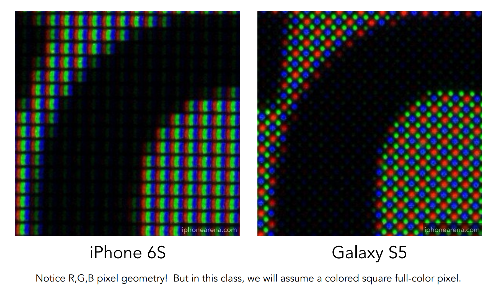

那么，如何把投影变换后 $[-1,1]^2$ 的观测平面变换到 $[0,width]\times[0,height]$ 的屏幕上去呢？很简单，**先缩放，再移动**，把左下角当做原点。该变换称为**视口变换**（Viewport transformation）。
$$
M_{viewport}=
\begin{pmatrix}
\frac{width}{2}&0&0&\frac{width}{2}\\
0&\frac{height}{2}&0&\frac{height}{2}\\
0&0&1&0\\
0&0&0&1
\end{pmatrix}
$$
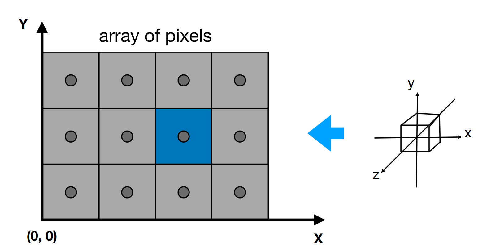

## 采样

那么我们怎么进行光栅化呢？这就牵涉到一个信号处理中的重要概念——**采样**（Sampling）：采样是将连续信号（在图形学中指的是连续图像）转换为离散信号（数字图像）的过程。

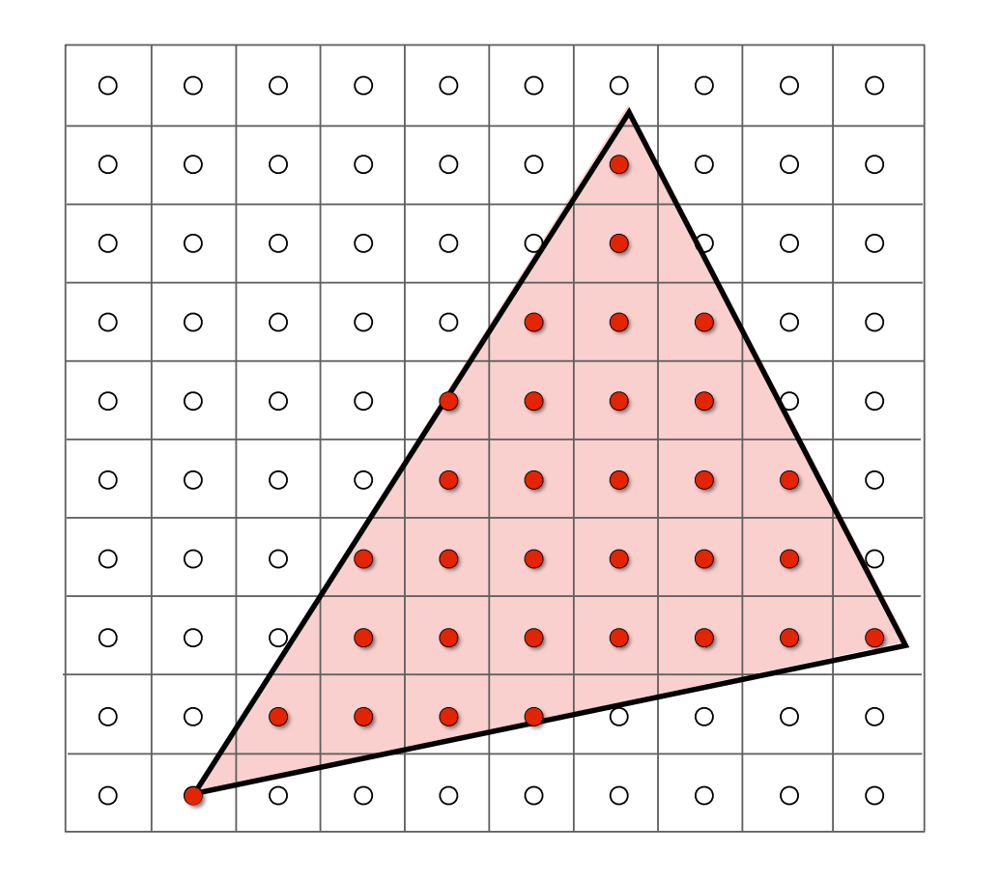

图形学中，最基本的采样方式就是通过判断像素中心是否被图像覆盖来决定是否采样该像素点。这时我们选择用三角形作为图元的一个好处就显露出来了：**我们很容易判断一个点是否在三角形内**。

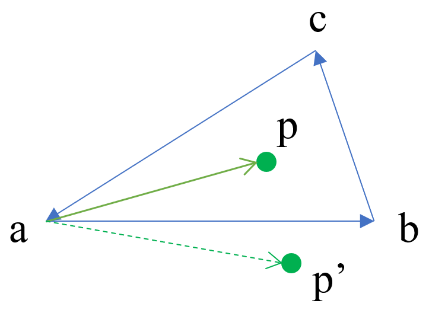

如图所示，设屏幕外部为 $>0$，内部为 $<0$，对于三角形内部的点，有
$$
\begin{align*} \vec{ab}\times\vec{ap}&>0\\ \vec{bv}\times\vec{bp}&>0\\ \vec{ca}\times\vec{cp}&>0\\ \end{align*}
$$
也就是说，如果三个叉积都为正，那么 p 在三角形内部；如果有任意一个叉积为负，那么 p 在三角形外部；如果 p 在某一条边上，那么该边上的叉积为 0。

## 走样

采样虽然简单，但对不同的对象采样都会有些问题，比如说：走样、摩尔纹、车轮效应等。图形学里有个术语，叫 **artifact**，代表瑕疵、错误的概念。而产生问题的根本原因在于**采样的频率跟不上信号改变的频率**，也叫采样率不足。

如图所示，根据上面的采样法，我们最终得到的三角形实际上是有很多锯齿的，这种情况学名就叫做**走样**（aliasing），要解决这个问题，就需要**反走样**（antialiasing）算法。

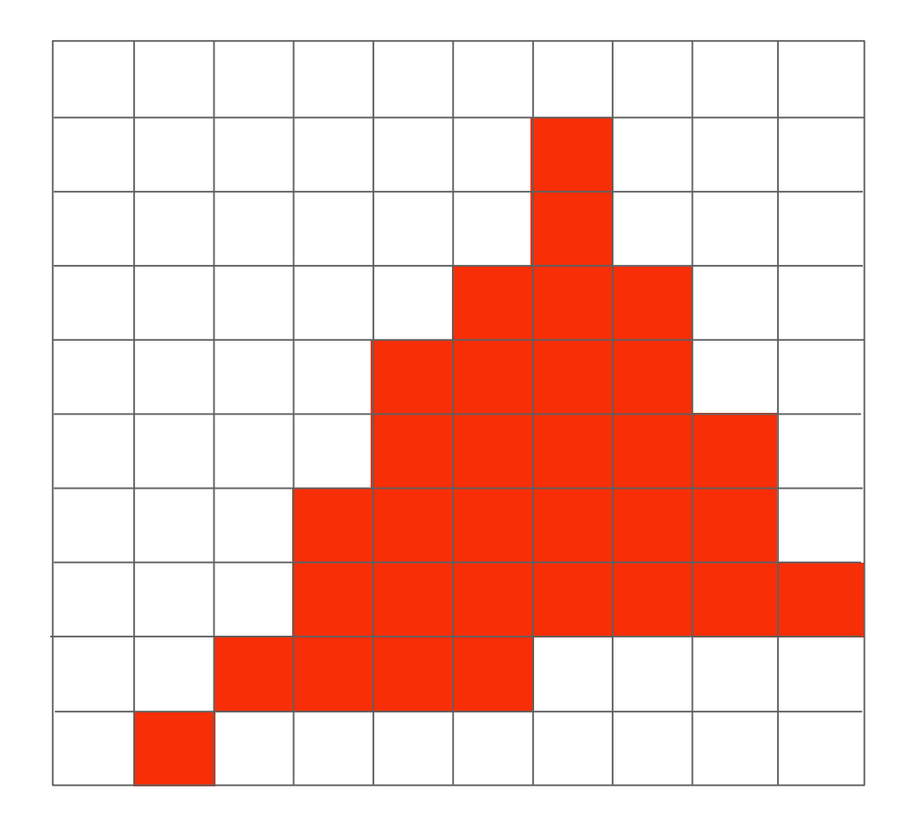

## 用信号理解采样和走样

在时域中，采样等效于选取离散的信号。可以看到，当采样点不够密集时，一组采样对应了两组完全不同的信号，这就是走样。

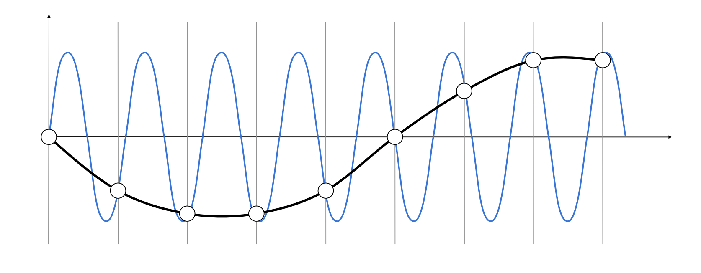

在频域中，采样等效于对频谱进行周期性的重复和叠加，这称为频谱的周期性扩展。可以看到，当采样频率不够时，信号之间就会混淆。

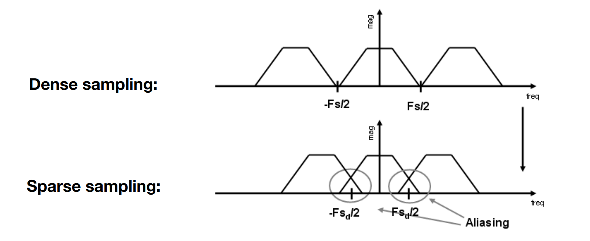

## 抗锯齿 (反走样算法)

通过上面一通分析，我们理解了走样背后的原理，那么在图形学里，我们如何反走样（抗锯齿）？

最直白的方式就是**增加采样率**，也就是增加屏幕的分辨率。不过这是硬件层面的方法，我们的目的是软件层面的反走样算法。

### Blurred Aliasing（模糊采样）

先对信号做模糊（低通滤波），再做采样。

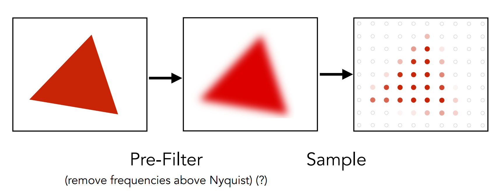

用信号解释，就是先砍掉高频在采样，如下图所示，砍掉高频后重复的频谱之间自然变得稀疏了：

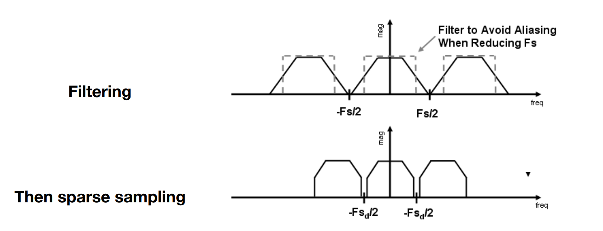

### SSAA（超级采样抗锯齿）

强行拉大图像分辨率，直接在内存中存一个放大的图像渲染，然后再通过取多个像素的平均值合并成一个像素以缩小回去。

### MSAA（多重采样抗锯齿）

MSAA 是 SSAA 的一种改良方法，它不是放大图像渲染，而是把一个像素假装分解做多个像素，比如 4xMSAA 就是一个像素看成 4 个像素，然后分别对每个逻辑像素采样，最后取平均值。实际上，MSAA 就是另一种形式的模糊操作。

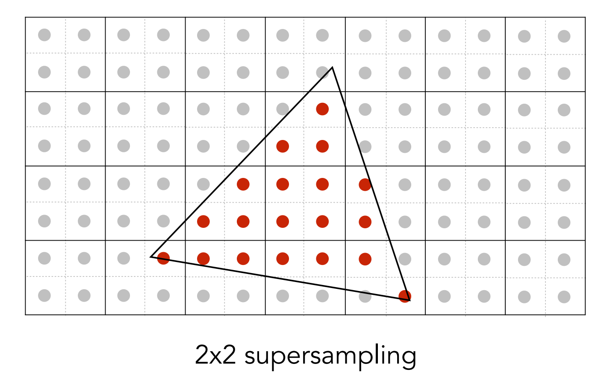

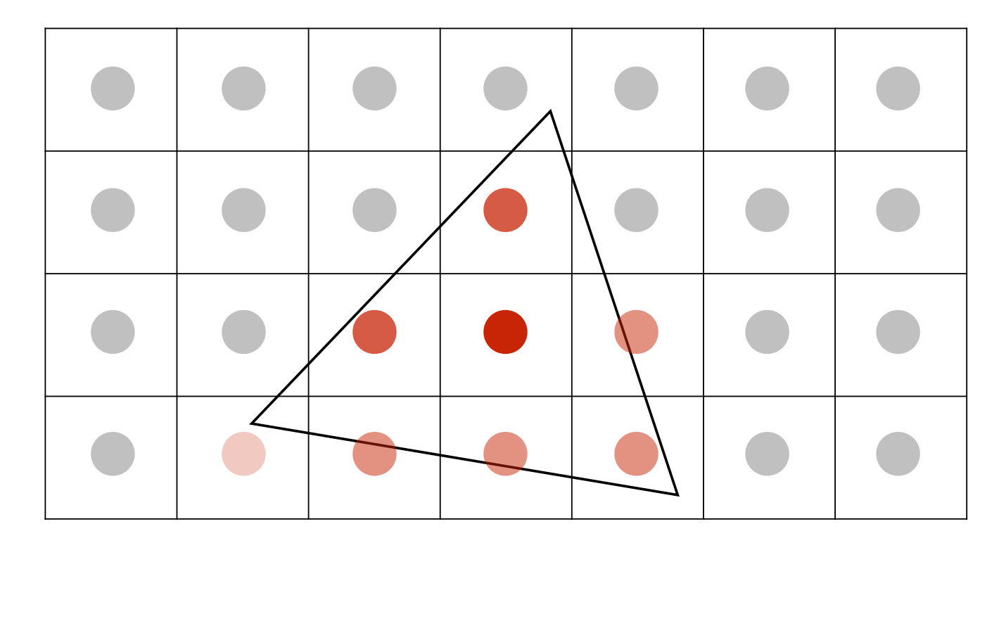

### FXAA（Fast Approximate AA，快速近似抗锯齿）

不做模糊，直接得到带锯齿的图像，然后通过算法找到边界，在把边界替换成没有锯齿的边界。FXAA 非常快。

### TAA（Temporal AA）

每一帧的采样点不一样，然后复用上一帧的感知结果，相当于把 MSAA 拉长到了时间轴上。所以 TAA 是会有拖影的。